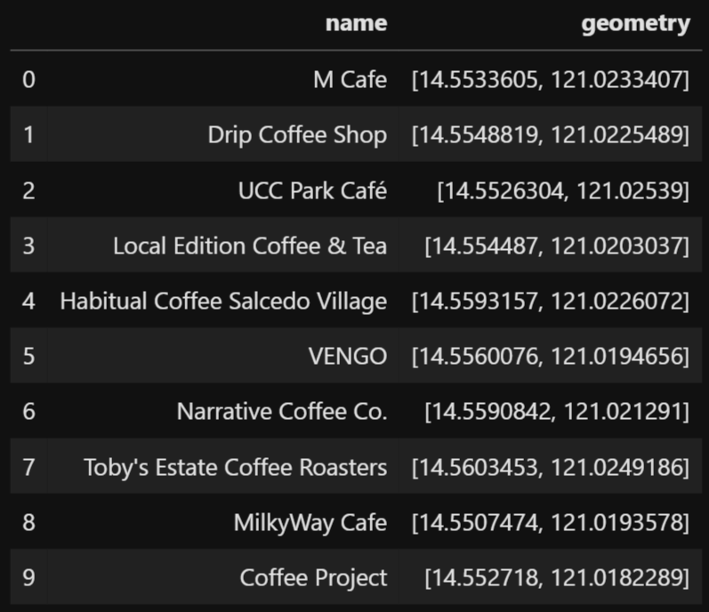
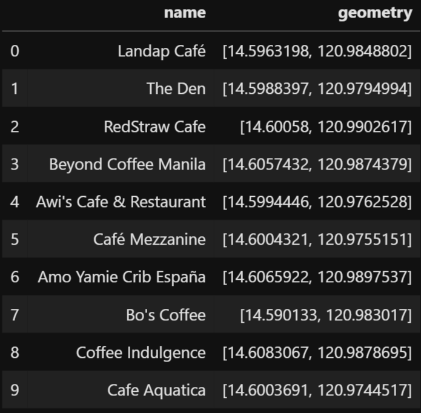

### Step-by-Step Tutorial to Access Google API Services using Python 

#### Map Data
Access to accurate real-time map data has become crucial to our everyday life, not just to businesses. Guess what, we can also access these databases! But how do we get access? Through API!

#### What is an API
An API, short for application processing interface, is simply a method by which two computer applications can communicate with each other over a network (such as the Internet). This allows authenticated end users to access data and services that have been developed by other people without the need to code or create softwares on their own from scratch. Although there are several applications that provide map data, here we'll be focusing on Google Maps. This is because Google updates their database frequently and provides several APIs that are user-friendly.
	
Here, we'll write a script that automatically makes requests to Google API and returns the results as a table. In particular, we'll be using Places API. For implementation, we'll be coding everything using the Python programming language for its user-friendliness. In addition, we'll be utilizing the googlemaps python package, which is an easy-to-use Python wrapper for the Google Maps and Local Search API. 

As with any other application, proper usage of their APIs is well-documented, including their exact functionality as well as usage limitations and constraints. For more information, visit their official website [Google Places](https://cloud.google.com/maps-platform/places).

#### Import Dependencies
The following packages are needed for this tutorial: 
```python 
import time
import googlemaps
```
The libraries time and googlemaps are used to artificially create delay in between code execution and access Google APIs services, respectively.

#### Class Initialization
The approach we'll be taking is an object-oriented approach. This allows our code to be more organized, easy to modify, and reusable through inheritance. These advantages will be explored in the later sections. 

The first step is to create a class and attach two main attributes to it, namely, api_key and place_type. The former is used to contain the user API key needed for authenticating the use of Google APIs, while the latter contains the type of establishment we're interested in. 

```python 
class Gmaps_Search():
    # initialize class by defining api key and search query constaints
    def __init__(self, api_key, place_type):
        self.key = api_key
        self.type = place_type
```

Next, we define a method called `search_query()` that would contain the code that can accept queries as input and return the list of locations as output. To have access to Google services, we first need to authenticate our request by providing a unique API key as follows:  
```python
    # define function to search query and return results
    def search_query(self):
        # authenticate user 
        gmaps = googlemaps.Client(key=self.key)
```

#### Extract City Coordinates
Now that we have access to Google APIs, we can start making a request. Specifically, we need the latitude and longitude coordinates of the city that we're interested in. To accomplish this, we simply call the function `find_place()` and provide it with the three necessary arguments. The first argument should contain the query in the form of a string. To prevent the possibility of results being found outside the Philippines, we'll include the string `, Philippines` as part of our query. As it requires an additional input from the user, we add the parameter `city` in the `search_query()` method. We'll then store the results in the `lat` and `lng` variables for use later.
```python 
    # define function to search query and return results
    def search_query(self, city):
        # authenticate user 
        gmaps = googlemaps.Client(key=self.key)
                
        # extract lat long coordinates of specified city
        request = gmaps.find_place(city + ', Philippines', 'textquery', ['name', 'geometry'])
        lat = request['candidates'][0]['geometry']['location']['lat']
        lng = request['candidates'][0]['geometry']['location']['lng']
```

#### Search Cafes via Places API 
Finally, we use the city coordinates to get cafe stores found within the city. We first create a list that would contain the results of our query. To obtain the nearest cafes from the city coordinates, we call the method `places_nearby()` and again, provide it with the necessary arguments. The first argument is the required geocoordinates, and must be supplied as a dictionary. The second argument specifies that we want the results to be sorted by distance. The last two arguments constrains the results by the type of establishment and city location.
```python
      # return nearest 60 location given city coordinates
      results = list()
      request = gmaps.places_nearby({'lat':lat, 'lng':lng}, rank_by='distance', type=self.type, keyword=city)
      results += request['results']
      for j in range(2):
          time.sleep(3)
          try:
              request = gmaps.places_nearby({'lat':lat, 'lng':lng}, rank_by='distance', type=self.type,
                                          keyword=city, page_token=request['next_page_token'])
              results += request['results']
          except KeyError:
              break
```
Notice that I've included an exception statement, as well as the line `time.sleep(3)` which sets a delay of three seconds for each iteration. This is in anticipation of errors arising from making more requests when there are no more results to be returned, or when the maximum limit of requests has been reached. 

Putting it all together, we now have created a class that can search for cafes found within a specified city in the Philippines. 
```python 
class Gmaps_Search():
    # initialize class by defining api key and search query constaints
    def __init__(self, api_key, place_type):
        self.key = api_key
        self.type = place_type
    
    # search location within specified city
    def search_query(self, city):
        # authenticate user 
        gmaps = googlemaps.Client(key=self.key)
        
        # extract lat long coordinates of specified city
        request = gmaps.find_place(city + ', Philippines', 'textquery', ['name', 'geometry'])
        lat = request['candidates'][0]['geometry']['location']['lat']
        lng = request['candidates'][0]['geometry']['location']['lng']

        # return nearest 60 location given city coordinates
        results = list()
        request = gmaps.places_nearby({'lat':lat, 'lng':lng}, rank_by='distance', type=self.type, keyword=city)
        results += request['results']
        for j in range(2):
            time.sleep(3)
            try:
                request = gmaps.places_nearby({'lat':lat, 'lng':lng}, rank_by='distance', type=self.type,
                                            keyword=city, page_token=request['next_page_token'])
                results += request['results']
            except KeyError:
                break
        
        # transform results from dictionary to geodataframe
        name = [result['name'] for result in results]
        geoloc_list = [[result['geometry']['location']['lat'], result['geometry']['location']['lng']] for result in results]
        output = gpd.GeoDataFrame(zip(name, geometry), columns=['name', 'geometry'])
        return output
```
#### Sample Implementation
Now that we're done writing our class, let's try to create an instance that searches for cafes in the city of Makati.
We first call `Gmaps_Search()` and providing it with a valid API key and `cafe` as the type of establishment as follows:  
```python
# initialized class to search for cafes
gmaps = Gmaps_Search(api_key=key', 'cafe')
```
We then simply call the method `search_query()` and provide `'Makati'` as the input to get the list of cafes found in Makati.
```python
# search cafes located within the city of Makati
results = gmaps.search_query('Makati')
```
To view the top 5 results, we simply run 
```python
results.head(10)
```
Output:



To get the cafes found in another city, say Manila, we simply write
```python
# search cafes located within the city of Manila
results = gmaps.search_query('Manila')
results.head(10)
```
Output:



#### Further Explorations 
As mentioned earlier, the use of class makes it easier for other people to modify some sections of the code to satisfy specific user needs without rewriting everything from scratch. For example, if we want to search cafes outside the Philippines, we simply remove the string `' Philippines'` from the `search_query()` method. 

Another advantage is that we can create different instances of the same class. If our goal is to search for banks instead of cafes, we simply replaced the type from `'cafe'` to `'bank'` when creating an instance. For a list of valid place types, visit the following link [Place Types](https://developers.google.com/places/supported_types).
We can also add additional complexity to our class by creating additional methods that would return specific information that the user specifically needs or a method that would visualize the results on a map.
